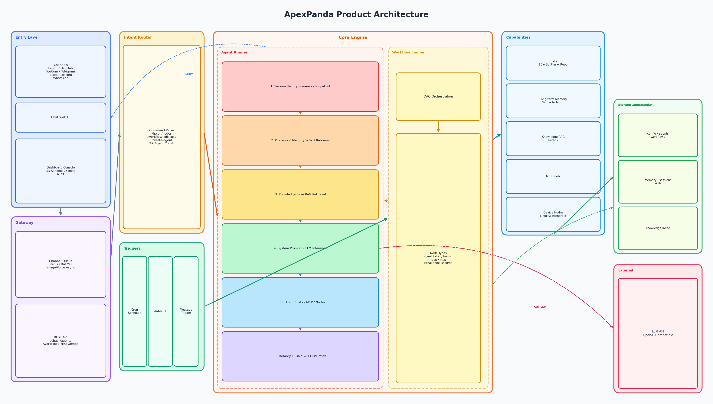
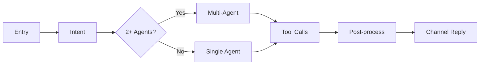
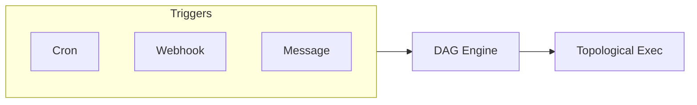

# ApexPanda v1.3.1

English | [中文](./README.md)

[](./package.json)
[](https://nodejs.org)
[](./LICENSE)

**Co-produced by HackingGroup** · Author: Lianpu

**Related repos**: [apexpanda-release](https://github.com/ApexPanda-Ai/apexpanda-release) (pre-built) · [apexpanda-node](https://github.com/ApexPanda-Ai/apexpanda-node) (node client: Headless / Desktop / Android)

For individual developers and teams: deploy on a single machine; connect to Feishu, DingTalk, Telegram and other daily channels out of the box. Team collaboration extends to RBAC, audit, and multi-Agent coordination. **Long-term memory** enables cross-session persistence, automatic extraction, and associative retrieval; **procedural memory** automatically turns successfully executed scripts into reusable skills that improve with use; **multi-Agent collaboration** supports debates (`/debate`) and task coordination (supervisor, pipeline, parallel, plan modes)—triggered by @ mentioning in groups. With 80+ Skills ecosystem, workflow DAG orchestration, knowledge base RAG, MCP tool extensions, and device nodes, from personal productivity to enterprise applications, one platform covers it all.

---

## Platform Advantages

| Advantage | Description |
|-----------|-------------|
| **🔒 Data Sovereignty** | Fully self-hosted; conversations, memory, and knowledge base stay local with no data leakage |
| **🛡️ Security & Control** | Compliance audit, sensitive word filtering, RBAC, traceable operations; **delete confirmation by source** (user/channel requires confirmation, agent auto-executes); lightweight for personal use, enterprise features on demand |
| **📬 Multi-Channel Unified** | Feishu, DingTalk, WeCom, Telegram, Slack, Discord, etc.—one config, sync everywhere; @Agent in groups to route to different bots; progress pushed to channels for long tasks ("Searching…", "Creating file…") |
| **🧠 Long-term Memory** | Cross-session persistence, auto-extraction, tiered decay, scope isolation (user/group/Agent-specific), conflict detection, associative retrieval |
| **📝 Procedural Memory** | Successful scripts auto-refined into skills with trust levels (unverified→trusted); prioritize reuse next time, faster over time |
| **🔧 Skills Ecosystem** | 80+ built-in Skills, one-click install from GitHub/GitLab, OpenClaw compatible, third-party Skills plug-and-play |
| **👥 Multi-Agent Collaboration** | Parallel Agents, @ routing, shared/exclusive memory, debate/voting; **single-task entry**: auto-select Agent and plan when no @; **verification layer**: Plan→Execute→Verify→Retry loop |
| **🖥️ 3D Sandbox** | Deep-space command center: Agent planets, device orbits, data-flow beams, task pipeline in real time; auto-select hints, Verify step display |
| **💰 Cost Control** | Token stats, cost estimation, budget alerts, trend export to avoid runaway usage |
| **🌐 Device Nodes** | Remote Linux/Windows/Android nodes: sysRun, batchSysRun (multi-node), uiTap, uiSequence, uiFlow, uiTapByImage, screenOcr, locationGet, etc., for real-environment execution |

---

## Platform Architecture



**Architecture Overview:**

- **Channel Access**: Feishu (Webhook + WebSocket), DingTalk, WeCom, Telegram, Slack, Discord, WhatsApp unified via Gateway
- **Channel Queue**: Feishu image/voice async messages queued (in-memory or Redis/BullMQ), multi-instance consumption, debounce and discard policies
- **Agent Runner**: Message → session history → RAG retrieval → long-term memory injection → **procedural memory skill retrieval** → system prompt → LLM → tool loop (Skills/MCP/nodes) → reply → memory extraction flush, skill refinement
- **Workflow Engine**: DAG orchestration, agent/skill/human/loop/mcp nodes, cron, Webhook, message triggers, human nodes with resume
- **Capability Layer**: Skills (80+ built-in + registry), long-term memory (scope isolation), knowledge base RAG (Rerank), MCP, device nodes

---

## Message Execution Flow

Pipeline after a user sends a message via a channel (e.g., Feishu group):


**Key Steps:**

| Stage | Description |
|-------|-------------|
| **Entry** | Feishu image/voice etc. queued (memory or Redis); text goes directly to `processChannelEvent` |
| **Intent** | `/help`, `/nodes`, `/workflow`, `/debate`, `/create-agent` (create Agent from channel description when agentCreateEnabled); @ 2+ Agents → multi-Agent; else single-Agent |
| **Agent Chat** | `runAgent`: session history + memoryScopeHint + **procedural memory skill retrieval** + knowledge RAG → system prompt → LLM → tool loop (N rounds max) → reply |
| **Procedural Memory** | Pre-chat skill retrieval (trigger phrases/tags/semantic match); trusted skills injected to prompt for reuse; on `task_done`+`exitCode=0` auto-refined to `skills.json` |
| **Tool Calls** | LLM tool_call → `invokeToolByName` → Skills Executor (memory, web-search, code-runner, nodes) → result to messages → continue LLM |
| **Post-process** | Every N rounds or before truncation: `extractAndWriteMemories`; append session; reply via channel client |

### Workflow Trigger Flow



On cron, Webhook, or message trigger, engine runs nodes in DAG topological order.

---

## Features Overview

| Module | Description |
|--------|-------------|
| **AI / Models** | LLM config (API base URL, keys), multi-model switch, Agent model binding, system prompt customization, Chat web UI |
| **Agent Management** | Multi-Agent config (handle, category, memoryVisibility, workerIds, skillIds, nodeToolsEnabled), channel @ routing, multi-Agent Tab |
| **Channels** | Feishu, DingTalk, WeCom, Telegram, Slack, Discord, WhatsApp, Lark; Webhook / long-connection / long-polling |
| **Sessions & Memory** | Session list (by channel/tenant), long-term memory (view/export), batch clear |
| **Procedural Memory** | Script skills auto-refined (task_done+exitCode=0), trust levels (unverified→trusted), trigger/semantic retrieval, reuse priority, Dashboard view |
| **Skills Center** | 80+ built-in Skills, registry install, ZIP upload, env config, test calls, OpenClaw compatible |
| **Workflows** | DAG (agent/skill/human/loop/mcp nodes), cron, Webhook, message triggers, human node resume |
| **Knowledge Base** | LanceDB vector store, RAG retrieval, text/JSON import, Rerank (Cohere/Jina) |
| **Device Nodes** | Remote Linux/Windows/Android: sysRun, batchSysRun (multi-node), uiTap, uiSequence, uiFlow, uiTapByImage, screenOcr, locationGet (Android), pairing, approval, nodeTags, exec history |
| **Multi-Agent** | Debate mode (`/debate`), collab mode (@ multiple Agents: supervisor/pipeline/parallel/plan); **single-task entry**; **verification layer**; run history |
| **3D Sandbox** | Command center: Agent planets, device orbits, data-flow beams, task pipeline; auto-select hints, Verify step cards |
| **Cost & Usage** | Token stats, cost estimation, budget alerts, trend charts, CSV export |
| **Audit** | Operation logs, compliance export, CSV/JSON |
| **Voice Wake** | Settings → Voice Wake: trigger words, TTS, ASR (browser Web Speech / Feishu ASR); Chat page mic, speak to send to Agent |
| **Setup Wizard** | First-time LLM, channel config, API Key generation (Docker/pre-built) |

---

## Quick Start

### Option 1: Docker

#### One-command Install (Linux servers)

Auto-install Docker, pull image, start container. Supports Ubuntu / Debian / CentOS / RHEL / Rocky Linux / AlmaLinux:

```bash
# Requires root
sudo bash scripts/install-docker-and-pull.sh
```

Script: check/install Docker, pull `apexpanda/apexpanda:1.3.1`, start container on port 18790. Open **http://<server-IP>:18790** for admin. Add `-v /opt/apexpanda-data:/app/.apexpanda` for data persistence.

#### docker-compose (existing Docker)

```bash
cp .env.example .env
# Edit .env: APEXPANDA_LLM_BASE_URL, APEXPANDA_LLM_API_KEY, etc.

docker-compose up -d
# Visit http://localhost:18790
```

Data: `apexpanda_data` volume mounted to `/app/.apexpanda`. **First deploy** (no `.installed`) runs setup wizard for LLM, channels, API Key.

### Option 2: Pre-built (apexpanda-release)

Clone [apexpanda-release](https://github.com/ApexPanda-Ai/apexpanda-release). **Windows**: double-click `start.bat`. **Linux/macOS**: `chmod +x start.sh && ./start.sh`. Requires Node.js >= 22, pnpm 9.x. See [Pre-built (apexpanda-release)](#pre-built-apexpanda-release) below.

### Option 3: Kubernetes

```bash
docker build -t apexpanda:1.3.1 .
kubectl apply -f deploy/kubernetes/deployment.yaml
```

---

## Requirements

- **Node.js** >= 22
- **pnpm** >= 9

---

## Dashboard

| Page | Features |
|------|----------|
| **Overview** | System status, workflow/knowledge/memory/procedural-memory/usage stats, shortcuts, usage trends |
| **Chat** | Multi-Agent chat, session history, **intent mapping** (built-in + custom); file passthrough for images/audio |
| **Agents** | Create/edit (handle, category, systemPrompt, model, skillIds, etc.); templates; **Command Center** Tab for multi-Agent runs |
| **3D Sandbox** | Agent planets, device orbits, data-flow beams, task pipeline; auto-select hints, Verify step cards |
| **Sessions & Memory** | **Sessions** Tab: list by channel, tenant, memory counts, batch export/clear; **Long-term Memory**: view/export; **Procedural Memory**: skills, trust levels, delete/reset |
| **Channels** | Feishu/Lark/DingTalk/WeCom/Telegram/Slack/Discord/WhatsApp; defaultAgentId, mentionEnabled, agentCreateEnabled |
| **Device Nodes** | Online nodes, pairing code, sysRun/uiTap, approval, exec history |
| **Skills** | 80+ built-in, registry install, ZIP upload, env config, test calls, OpenClaw compatible |
| **MCP** | Registry install, custom servers, tool list |
| **Knowledge Base** | Text/JSON import, vector search, Rerank config |
| **Workflows** | DAG editor, cron, Webhook, message triggers, templates, human node resume |
| **Cost & Usage** | Token stats, model breakdown, trends, budget alerts, CSV export |
| **Settings** | LLM, model routing, sensitive words, delete confirmation, CORS, debate, memory, multi-Agent |
| **Audit** | Operation logs, compliance export, CSV/JSON |
| **Setup Wizard** | First-time LLM, channel, API Key (Docker/pre-built) |

---

## Channel Integration

| Channel | Mode | Notes |
|---------|------|-------|
| **Feishu / Lark** | Long-connection / Webhook | @Agent routing; image/voice deferred queue |
| **DingTalk** | Webhook / Outgoing / Stream | Outgoing uses sessionWebhook; Stream long-connection mode optional |
| **WeCom** | Webhook | App messages, proactive replies |
| **Telegram** | Long-polling | No public Webhook; TELEGRAM_BOT_TOKEN |
| **Slack** | Socket / Webhook | Socket needs App-Level Token (connections:write) |
| **Discord** | Gateway | Requires Message Content Intent |
| **WhatsApp** | Cloud API | Meta developer; Verify Token, Access Token, Phone Number ID |

---

## Skills

### Built-in (80+)

| Category | Examples |
|----------|----------|
| **Data/Calc** | calculator, data-transform, csv-analyzer, exchange-rate, json-path |
| **Web/Search** | web-fetch, web-scraper, web-search, arxiv-search, news-aggregator |
| **Tools/Gen** | qrcode-gen, password-gen, chart-gen, base64, hash, **shortlink** (create/resolve, /s/xxx 302) |
| **File/Docs** | file-tools, pdf-reader, office-reader |
| **Dev** | code-runner, docker-manage, api-tester |
| **Automation** | browser-automation, desktop-automation, remote-exec, shell-exec |
| **Enterprise** | feishu-doc, dingtalk-todo, jira, yuque-doc |
| **Media** | ocr-tencent, tts-azure, asr-aliyun, image-gen-wanx |
| **Monitor** | healthcheck, server-monitor, webhook-trigger |

### Registry Install

From GitHub / GitLab / **Gitee**:

- Enter repo URL, fetch Skill list
- Select repo (cache multiple, switch/delete)
- One-click install, env form, test calls
- **OpenClaw**: SKILL.md format, workflow skills auto-parsed

### ZIP Upload

- Full Skill directory ZIP (with scripts, APEX_SKILL.yaml required, ≤ 10MB)
- Single APEX_SKILL.yaml can reference built-in handler for config-only Skills

---

## Long-term Memory

Cross-session memory; user preferences and facts; "gets to know you over time."

### Capabilities

| Capability | Description |
|------------|-------------|
| **Persistence** | Scope-isolated (user/group/Agent), persisted, survives restart |
| **Auto-extraction** | LLM extracts key info every N rounds; before truncation |
| **Tiers** | **fact**: long-lived (preferences, names), configurable half-life (default 30d); **log**: short (today), faster decay (7d) |
| **Conflict** | Contradictions → UPDATE; duplicates → SKIP |
| **Associative retrieval** | memory#search with context gating, graph expansion (1-hop) |
| **Agent-specific** | `shared` or `agent-only` per Agent |

### Tools (memory Skill)

- `memory#write`: Remember ("remember XXX")
- `memory#search`: Keyword search ("what do I like", "last time")
- `memory#read` / `memory#list`: Exact read/list by key or id
- `memory#delete`: Delete ("forget XXX")

### Advanced

- **sessionIndexInSearch**: Include recent sessions in search
- **consolidation**: Clustering, LLM summary, archive (cron)
- **exportMarkdown**: Sync export for backup

---

## Procedural Memory

Successful tasks auto-saved as reusable skills; "smarter with use"—next similar task runs directly.

### Capabilities

| Capability | Description |
|------------|-------------|
| **Auto-refinement** | On `task_done` + `exitCode=0` → write to `.apexpanda/skills.json` |
| **Trust levels** | unverified → testing (1–2 success) → trusted (≥3, ≥70% rate); suspend on 3 failures or <40% rate |
| **Reuse priority** | Pre-chat skill search; trusted skills recommended in prompt |
| **Tracking** | successCount, successRate, consecutiveFailures; dynamic upgrade/downgrade |

### Workflow

1. **Refinement**: Task → script, run, debug → task_done + exitCode=0 → write to skills (path, triggers, description, env)
2. **Reuse**: Next similar task → match skills → inject by confidence (trusted/tested/suspended) → LLM reuses or creates new

### Lifecycle

| Stage | Condition |
|-------|-----------|
| **Create** | task_done dual-check; unverified |
| **Upgrade** | successRate ≥ 70% and useCount ≥ 3 → trusted |
| **Downgrade** | 3 consecutive failures or <40% → suspended |
| **Archive** | 90 days unused → archived; not recommended |

---

## Knowledge Base

**Hybrid retrieval** (BM25 + local vectors + RRF), fully offline.

### Architecture

| Component | Description |
|-----------|-------------|
| **BM25** | Full-text inverted index, bigram tokenization, strong recall for CVE/codes |
| **Vector** | Local `bge-small-zh-v1.5` (512d), semantic recall |
| **RRF** | Merge and rank both paths |
| **Rerank** | Optional `bge-reranker-base` |

### Config

- **LanceDB path**: Default `.apexpanda/knowledge.lance`; override via `APEXPANDA_KNOWLEDGE_LANCE_PATH`
- **Chunk strategy**: `APEXPANDA_CHUNK_STRATEGY` = `char` / `heading` / `case`
- **Hybrid**: Default on; `APEXPANDA_HYBRID_SEARCH_ENABLED=false` for LanceDB + optional external Embedding
- **BM25 persist**: `APEXPANDA_BM25_PERSIST=true` for large KBs; loads from `.apexpanda/bm25-index.json` on restart

### Dimension change & clear

`bge-small-zh-v1.5` is fixed **512d**. Changing models may change dimension; system will reject writes.

**Clear**: Delete LanceDB dir, meta, BM25 index, then re-import.

```bash
rm -rf .apexpanda/knowledge.lance .apexpanda/knowledge-meta.json .apexpanda/bm25-index.json
```

---

## Multi-Agent Collaboration

Debate mode and task collab; useful for complex decisions, brainstorming, multi-role work.

### Capabilities

| Capability | Description |
|------------|-------------|
| **Debate** | Multiple Agents speak in rounds; agree, add, or rebut; auto-summary at end |
| **Collab** | Sequential or parallel: supervisor, pipeline, parallel, plan (DAG) |
| **Single-task** | No @ → auto-select Agent and plan; transparent reason; cancel or @ override |
| **Verification** | Plan→Execute→Verify→Retry; plan can add Verify after each agent step |
| **@ Routing** | @Agent1 @Agent2 to specify participants; omit for all/default |
| **Memory** | shared or agent-only; debate/collab use session context |

### Debate (`/debate`)

- Format: `/debate <topic> [rounds] [@Agent1 @Agent2...]`
- Rounds: 1–10, default 3
- Early end: "stop", "end debate", etc. (configurable)

### Single-task + Auto-select

- LLM picks 1–N Agents by task semantics and Agent category/skillIds
- Transparency: "Gathered [xxx] for this task because: ..."; user can cancel or @ override
- Fallback: default Agent; `/single` for single-Agent only
- Config: `multiAgent.autoSelectAgent`, `autoSelectMaxAgents`

### Collab modes (@ 2+ Agents)

| Mode | Description |
|------|-------------|
| **Supervisor** | One leader, others workers; `delegate_to_worker` |
| **Pipeline** | Sequential; Product→Design→Dev etc. |
| **Parallel** | All Agents run same task; results merged |
| **Plan** | LLM builds DAG; workflow engine executes |

Inline: `/pipeline`, `/parallel`, `/plan`; e.g. `/pipeline @Product @Design @Dev build login page`

### Verifier

- `type: 'verify'` node: LLM/rule/Skill validators
- `{ pass: boolean, issues?: string[] }`; retry or branch on fail
- Plan: `verifyEnabled=true` inserts Verify after each agent step
- Sandbox: Verify cards (pass=fail=pending)

### Memory

- Debate/collab use `memoryScopeHint`
- `memoryVisibility`: shared or agent-only
- Collab context to next Agent; explicit `memory#write` for persistence

### Config

- **Debate**: defaultRounds, maxRounds, maxAgents, endPhrases, timeoutMinutes
- **Collab**: collabMode, leaderSelection, planConfirmRequired, autoSelectAgent, verifyEnabled

---

## Configuration

Copy `.env.example` to `.env`:

| Variable | Description |
|----------|-------------|
| `APEXPANDA_LLM_BASE_URL` | LLM API (OpenAI-compatible) |
| `APEXPANDA_LLM_API_KEY` | API Key |
| `APEXPANDA_LLM_MODEL` | Default model |
| `APEXPANDA_PORT` | Port (default 18790) |
| `APEXPANDA_DATA_DIR` | Data dir (default `.apexpanda`) |
| `APEXPANDA_MEMORY_PERSIST` | Long-term memory persist |
| `APEXPANDA_SESSIONS_PERSIST` | Session persist (default true) |
| `APEXPANDA_KNOWLEDGE_PERSIST` | Knowledge base persist |
| `APEXPANDA_KNOWLEDGE_LANCE_PATH` | LanceDB path |
| `APEXPANDA_CHUNK_STRATEGY` | char / heading / case |
| `APEXPANDA_WORKFLOWS_PERSIST` | Workflow persist |
| `APEXPANDA_API_KEY` | API Key auth (auto-generated if unset) |
| `APEXPANDA_DELETE_CONFIRM_REQUIRED` | Delete confirmation (user/channel vs agent) |
| `APEXPANDA_HISTORY_LIMIT` | History turns to LLM (default 16) |
| `APEXPANDA_MAX_TOOL_ROUNDS` | Max tool rounds (default 12) |
| `CHANNEL_QUEUE_REDIS_URL` | Redis queue (multi-instance) |
| `FEISHU_APP_ID` / `FEISHU_APP_SECRET` | Feishu |
| `TELEGRAM_BOT_TOKEN` | Telegram |
| `DINGTALK_WEBHOOK_URL` | DingTalk |
| `WECOM_CORP_ID` / `WECOM_AGENT_ID` / `WECOM_SECRET` | WeCom |
| `JINA_API_KEY` / `COHERE_API_KEY` | Rerank |

Memory, debate, multi-Agent settings in Dashboard **Settings**.

---

## API & SDK

- **OpenAPI**: `/api/v1/openapi.json`
- **Health**: `/health`
- **Auth**: `Authorization: Bearer <key>` or `X-API-Key: <key>`

### Main Endpoints

| Endpoint | Description |
|----------|-------------|
| `POST /api/v1/chat` | Chat (message, sessionId, agentId) |
| `GET /api/v1/agents` | Agent list |
| `POST /api/v1/agents/select` | Auto-select Agent by task text |
| `GET/POST/PATCH/DELETE /api/v1/agents/{id}` | Agent CRUD |
| `GET /api/v1/sessions` | Sessions |
| `GET /api/v1/memory/counts` | Memory counts |
| `GET /api/v1/procedural-skills` | Procedural skills |
| `GET/POST/DELETE /api/v1/knowledge` | Knowledge base |
| `POST /api/v1/knowledge/search` | Search |
| `GET/POST /api/v1/workflows` | Workflow CRUD |
| `POST /api/v1/workflows/{id}/run` | Run workflow |
| `GET /api/v1/multi-agent-runs` | Multi-Agent run history |
| `GET /api/v1/nodes` | Device nodes |
| `GET/PATCH /api/v1/config` | Config |
| `GET /api/v1/usage` | Usage |
| `GET /api/v1/audit` | Audit |
| `GET/POST /api/v1/voicewake` | Voice wake config; `/recognize` server ASR, `/tts` TTS |
| `GET/POST /api/v1/workflow-templates` | Workflow templates; `POST /workflows/from-template` create from template |
| `POST /api/v1/sessions/bulk-delete` | Bulk delete sessions |
| `DELETE /api/v1/compliance/user-data` | Compliance: delete user data by tenantId (e.g. PIPL) |

### TypeScript SDK

```ts
import { createClient } from '@apexpanda/sdk';

const client = createClient({ baseUrl: 'http://localhost:18790', apiKey: 'optional' });
const { reply } = await client.chat({ message: 'Hello' });
```

---

## Project Structure

```
apexpanda/
├── packages/
│   ├── core/         # Gateway (API, channels, Agent Runner, Workflow, debate/collab, Skills)
│   ├── dashboard/    # Admin UI (React + Vite)
│   ├── shared/       # Shared types & utils
│   ├── sdk/          # TypeScript SDK
│   ├── node-desktop/ # Desktop node (Electron, camera/screen)
│   ├── node-android/ # Android node (Kotlin, camera/screen/UI automation/OCR)
│   └── skills/       # Built-in Skills
├── deploy/kubernetes/
├── .env.example
└── docker-compose.yml
```

### Android Node Build

```powershell
# Requires: JDK 11, Android SDK (sdk.dir in local.properties)
# Signing: packages/node-android/apexpanda-release.keystore (included)

$env:JAVA_HOME = "Q:\cs\client\client\jdk-11.0.15.1"
$env:PATH = "$env:JAVA_HOME\bin;$env:PATH"
Set-Location "D:\project\3\packages\node-android"
.\gradlew.bat assembleRelease --no-daemon
# Output: app\build\outputs\apk\release\app-release.apk
```

### Pre-built (apexpanda-release)

Pre-built package; no build step; quick deploy.

#### Get

- `git clone https://github.com/ApexPanda-Ai/apexpanda-release.git`

#### Requirements

- Node.js >= 22
- pnpm 9.x

#### Start

| Platform | Command |
|----------|---------|
| **Windows** | Double-click `start.bat` or run in terminal |
| **Linux / macOS** | `chmod +x start.sh && ./start.sh` |

First run: `pnpm install` (if no node_modules), copy `.env.example` to `.env` (if no .env), then start. Visit **http://localhost:18790**; first visit runs setup wizard.

#### Docker (Pre-built users)

```bash
docker run -d -p 18790:18790 apexpanda/apexpanda:1.3.1
```

Linux one-command install:

```bash
curl -fsSL https://www.apexpanda.net/install-docker-and-pull.sh | sudo bash
```

#### Config

- Copy `.env.example` to `.env`, edit as needed
- Or configure LLM, channels via Dashboard

Data in `.apexpanda/`: config.json, agents.json, workflows.json, memory.json, skills.json, knowledge/, sessions/, usage/, audit/, multi-agent-runs.json, etc.

---

## ApexPanda vs OpenClaw

Self-hosted AI platforms, independent implementations. ApexPanda: enterprise—DingTalk/WeCom/Feishu, RBAC, audit, sensitive-word filter, DAG workflow, knowledge RAG, multi-agent, MCP. OpenClaw: personal—50+ channels, ClawHub skills, iOS/Voice Wake.

Enterprise/compliance/China office → ApexPanda; personal/max channels → OpenClaw. See [docs/APEXPANDA_VS_OPENCLAW.md](./docs/APEXPANDA_VS_OPENCLAW.md).

---

## License

MIT License
