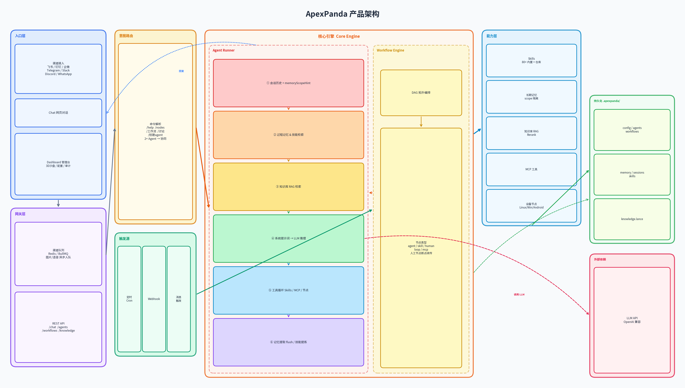
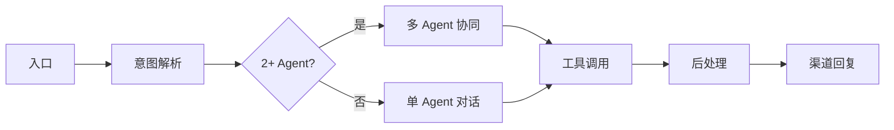
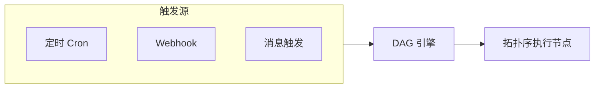

# ApexPanda v1.3.1

[English](./README.EN.md) | 中文

[](./package.json)
[](https://nodejs.org)
[](./LICENSE)

**HackingGroup 联合出品** · 开发作者：脸谱

**相关仓库**：[apexpanda-release](https://github.com/ApexPanda-Ai/apexpanda-release)（预编译版） · [apexpanda-node](https://github.com/ApexPanda-Ai/apexpanda-node)（节点端 Headless / 桌面 / Android）

面向个人开发者与团队：一人一机即可部署，飞书/钉钉/Telegram 等日常渠道即用即连；团队协作可扩展至 RBAC、审计、多 Agent 协同。**长期记忆**实现跨会话持久化、自动提取与联想检索；**过程记忆**将成功执行的脚本自动沉淀为可复用技能，越用越聪明；**多 Agent 协作**支持讨论辩论（`/讨论`）与任务协同（主从式、流水线、并行、动态规划），群内 @ 即可触发。配合 80+ Skills 生态、工作流 DAG 编排、知识库 RAG、MCP 工具扩展与设备节点，从个人效率到企业级应用，一平台贯通。

---

## 平台优势

| 优势 | 说明 |
|------|------|
| **🔒 数据自主** | 完全自托管，对话、记忆、知识库均在本地，无数据外泄风险 |
| **🛡️ 安全可控** | 合规审计、敏感词过滤、RBAC、操作可追溯；**按来源区分删除确认**（user/channel 需二次确认，agent 自动执行），个人使用轻量部署，企业级可按需启用 |
| **📬 多渠道统一** | 飞书、钉钉、企微、Telegram、Slack、Discord 等，一处配置多端同步；群内 @Agent 指定不同机器人；长任务时推送进度到渠道（「正在搜索…」「正在创建文件…」） |
| **🧠 长期记忆** | 跨会话持久化、自动提取、分层衰减、scope 隔离（用户/群组/Agent 专属），支持冲突检测与联想检索 |
| **📝 过程记忆** | 成功执行的脚本自动提炼为技能，信任分级（unverified→trusted），下次任务优先复用，越用越快 |
| **🔧 Skills 生态** | 80+ 内置 Skill，支持 GitHub/GitLab 仓库一键安装，OpenClaw 兼容，第三方 Skill 即装即用 |
| **👥 多 Agent 协作** | 多 Agent 并行、@ 路由、共享/专属记忆，支持辩论、投票等高级模式；**单任务入口**：无 @ 时自动选 Agent、自动规划；**验证层**：Plan→Execute→Verify→Retry 闭环 |
| **🖥️ 3D 沙盘** | 深空星图指挥台：Agent 星球、设备轨道、数据流光束、任务流水线实时可视化，支持自动选人提示、Verify 步骤展示 |
| **💰 成本可控** | Token 统计、成本估算、预算告警、趋势导出，避免调用失控 |
| **🌐 设备节点** | 远程 Linux/Windows/Android 节点：sysRun、batchSysRun（多节点并发）、uiTap、uiSequence、uiFlow、uiTapByImage、screenOcr、locationGet 等，打通真实环境执行 |

---

## ApexPanda平台架构



**架构说明：**

- **渠道接入**：飞书（Webhook + WebSocket）、钉钉、企微、Telegram、Slack、Discord、WhatsApp 等统一进入 Gateway
- **渠道队列**：飞书图片/语音等异步消息可入队（内存或 Redis/BullMQ），支持多实例消费、debounce 与丢弃策略
- **Agent Runner**：消息 → 会话历史 → RAG 检索 → 长期记忆注入 → **过程记忆技能检索** → 系统提示词 → LLM → 工具循环（Skills/MCP/节点）→ 回复 → 记忆提取 flush、技能提炼
- **Workflow Engine**：DAG 编排，支持 agent/skill/human/loop/mcp 节点、定时 cron、Webhook、消息触发，人工节点可断点续传
- **能力层**：Skills（80+ 内置 + 仓库）、长期记忆（scope 隔离）、知识库 RAG（Rerank）、MCP、设备节点

---

## 消息执行流程

用户通过渠道（如飞书群）发送消息后的处理链路：



**关键步骤说明：**

| 阶段 | 说明 |
|------|------|
| **入口** | 飞书图片/语音等需异步处理的消息入队（内存或 Redis），文本类直接进入 `processChannelEvent` |
| **意图解析** | `/help`、`/nodes`、`/工作流`、`/讨论`/`/debate`、`/创建agent`/`/create-agent`（渠道内描述创建 Agent，需 agentCreateEnabled）等走对应分支；消息中 @ 2 个及以上 Agent 时进入多 Agent 协同；否则进入单 Agent 对话 |
| **Agent 对话** | `runAgent`：会话历史 + memoryScopeHint + **过程记忆技能检索** + 知识库 RAG 检索 → 构建系统提示词 → LLM → 工具循环（最多 N 轮）→ 最终回复 |
| **过程记忆** | 对话前检索技能库（触发词/标签/语义匹配），trusted 技能注入 prompt 优先复用；工具执行成功且 `task_done`+`exitCode=0` 时自动提炼为技能写入 `skills.json` |
| **工具调用** | LLM 返回 tool_call → `invokeToolByName` → Skills Executor 执行（memory、web-search、code-runner、节点等）→ 结果写入 messages → 继续调用 LLM |
| **后处理** | 每 N 轮或截断前触发 `extractAndWriteMemories` 提取长期记忆；将会话追加到 session；通过渠道客户端回复用户 |

### 工作流触发流程



定时、Webhook 或消息触发工作流时，引擎按 DAG 拓扑序执行节点：


## 功能概览

| 模块 | 说明 |
|------|------|
| **AI / 模型** | LLM 配置（API base URL、密钥）、多模型切换、Agent 绑定模型、系统提示词定制、Chat 网页对话 |
| **Agent 管理** | 多 Agent 配置（handle、category、memoryVisibility、workerIds、skillIds、nodeToolsEnabled 等），渠道 @ 路由，多 Agent 协同 Tab |
| **渠道接入** | 飞书、钉钉、企微、Telegram、Slack、Discord、WhatsApp、Lark 等；Webhook / 长连接 / 长轮询 |
| **会话与记忆** | 会话列表（按渠道/租户）、长期记忆管理（查看/导出）、批量清除 |
| **过程记忆** | 脚本技能自动提炼（task_done+exitCode=0）、信任分级（unverified→trusted）、触发词/语义检索、优先复用、Dashboard 查看/管理 |
| **Skills 中心** | 80+ 内置 Skill，仓库安装、上传 ZIP、env 配置、测试调用，OpenClaw 兼容 |
| **工作流** | DAG 编排（agent/skill/human/loop/mcp 节点），定时 cron、Webhook、消息触发，人工节点断点续传 |
| **知识库** | LanceDB 向量存储、RAG 检索、文本/JSON 导入、Rerank（Cohere/Jina）增强 |
| **设备节点** | 远程 Linux/Windows/Android 节点：sysRun、batchSysRun（多节点并发）、uiTap、uiSequence（批量多步）、uiFlow（微脚本流程）、uiTapByImage（图像匹配点击）、screenOcr、locationGet（Android 定位）等，配对、审批、nodeTags 过滤、执行历史 |
| **多 Agent 协作** | 讨论模式（`/讨论`）、协同模式（@ 多个 Agent：主从/流水线/并行/规划）；**单任务入口**（无 @ 自动选 Agent）；**验证层**（plan 模式可选 Verify 节点）；运行历史 |
| **3D 沙盘** | 深空星图指挥台：Agent 星球、设备轨道、数据流光束、任务流水线；自动选人提示条、Verify 步骤（通过/失败）可视化 |
| **成本用量** | Token 统计、成本估算、预算告警、趋势图、CSV 导出 |
| **审计日志** | 操作记录、合规导出、CSV/JSON 格式 |
| **语音唤醒** | 系统配置 → 语音唤醒：唤醒词、TTS、ASR（浏览器 Web Speech / 飞书 ASR）；Chat 页麦克风入口，说话即发 Agent |

---

## 快速开始

### 方式一：Docker 部署

#### 一键安装（推荐 Linux 服务器）

自动安装 Docker、拉取镜像并启动容器，适配 Ubuntu / Debian / CentOS / RHEL / Rocky Linux / AlmaLinux：

```bash
# 需 root 权限
sudo bash scripts/install-docker-and-pull.sh
```

脚本会：检测 Docker 是否已安装（未安装则自动安装）、拉取 `apexpanda/apexpanda:1.3.1`、启动容器并映射 18790 端口。访问 **http://<服务器IP>:18790** 进入管理后台，首次运行会走安装向导。需持久化数据时可加 `-v /opt/apexpanda-data:/app/.apexpanda`。

#### docker-compose（已有 Docker 环境）

```bash
cp .env.example .env
# 编辑 .env：APEXPANDA_LLM_BASE_URL、APEXPANDA_LLM_API_KEY 等

docker-compose up -d
# 访问 http://localhost:18790
```

数据持久化：`apexpanda_data` volume 挂载到 `/app/.apexpanda`。**首次部署**（无 `.installed` 时）将进入安装向导，通过 Web 界面配置 LLM、渠道并生成 API Key.

### 方式二：预编译版（apexpanda-release）

从 [apexpanda-release](https://github.com/ApexPanda-Ai/apexpanda-release) 克隆后，**Windows** 双击 `start.bat`，**Linux/macOS** 执行 `chmod +x start.sh && ./start.sh`。支持 Windows / Linux / macOS，需 Node.js >= 22、pnpm 9.x。详见下方 [预编译版（apexpanda-release）](#预编译版apexpanda-release) 章节。

### 方式三：Kubernetes 部署

```bash
docker build -t apexpanda:1.3.1 .
kubectl apply -f deploy/kubernetes/deployment.yaml
```


---

## 环境要求

- **Node.js** >= 22
- **pnpm** >= 9

---

## 管理系统（Dashboard）

| 页面 | 功能 |
|------|------|
| **概览** | 系统状态、工作流/知识库/记忆/过程记忆/用量统计、快捷入口、用量趋势图 |
| **对话** | 多 Agent 对话（可选 Agent）、会话历史、**意图映射**（内置 + 自定义，如「打开百度」→ 指定 URL/工具）；工具生成图片/音频时**文件直通**到渠道 |
| **Agent 管理** | 创建/编辑 Agent（handle、category、systemPrompt、model、skillIds、mcpServerIds、memoryVisibility、workerIds、preferredNodeId、nodeToolsEnabled）；模板快速创建；**指挥中心** Tab 查看多 Agent 协同运行历史 |
| **3D 沙盘** | 深空星图指挥台：Agent 星球围绕中心、设备外层轨道、数据流光束、任务流水线；自动选人提示（「已为你自动选择 Agent：xxx，原因：...」）、Verify 步骤卡片（通过=绿/失败=红）；支持横向滑动浏览多任务 |
| **会话与记忆** | **会话** Tab：会话列表（按渠道筛选、租户 ID）、关联记忆条数、批量导出/清除；**长期记忆** Tab：查看与导出；**过程记忆** Tab：技能库查看、信任分级、触发词/描述、删除/重置 |
| **渠道管理** | 飞书/Lark/钉钉/企微/Telegram/Slack/Discord/WhatsApp 配置；defaultAgentId、mentionEnabled、agentCreateEnabled |
| **设备节点** | 在线节点列表、配对码、sysRun/uiTap 等命令、执行审批、执行历史 |
| **Skills 中心** | 80+ 内置 Skill、仓库安装、ZIP 上传、env 配置、测试调用、OpenClaw 兼容 |
| **MCP 管理** | Registry 安装、自定义 Server、工具列表 |
| **知识库** | 文本/JSON 导入、向量检索、Rerank 配置 |
| **工作流编排** | DAG 可视化编辑（agent/skill/human/loop/mcp 节点）、定时 cron、Webhook、消息触发、模板创建、人工节点断点续传 |
| **成本与用量** | Token 统计、按模型占比、成本趋势、预算告警、CSV 导出 |
| **系统配置** | LLM（API base URL、密钥、多模型）、**模型路由**（简单任务→廉价模型、复杂→主模型）、敏感词、**删除确认**（按来源 user/channel/agent）、CORS、**讨论**（轮数、endPhrases）、**长期记忆**（提取轮数、半衰期、consolidation）、多 Agent 协同 |
| **审计日志** | 操作记录、合规导出、CSV/JSON 格式 |
| **安装向导** | 首次部署时引导配置 LLM、渠道、生成 API Key（Docker/预编译版首次访问自动进入） |

---

## 渠道接入

| 渠道 | 模式 | 说明 |
|------|------|------|
| **飞书 / Lark** | 长连接 / Webhook | 群内 @Agent 指定不同 Agent；图片/语音等入队 deferred |
| **钉钉** | Webhook / Outgoing / **Stream** | 群机器人主动推送；Outgoing 用 sessionWebhook；Stream 长连接支持实时消息 |
| **企业微信** | Webhook | 应用消息、主动回复 |
| **Telegram** | 长轮询 | 无需公网 Webhook；TELEGRAM_BOT_TOKEN |
| **Slack** | Socket / Webhook | Socket 模式需 App-Level Token（connections:write）；Webhook 需 Signing Secret |
| **Discord** | Gateway | 需 Message Content Intent |
| **WhatsApp** | Cloud API | Meta 开发者平台；Verify Token、Access Token、Phone Number ID |

---

## Skills

### 内置 Skills（80+）

| 分类 | 示例 |
|------|------|
| **数据/计算** | calculator、data-transform、csv-analyzer、exchange-rate、json-path |
| **网络/搜索** | web-fetch、web-scraper、web-search、arxiv-search、news-aggregator |
| **工具/生成** | qrcode-gen、password-gen、chart-gen、base64、hash、**shortlink**（短链创建/解析，/s/xxx 302 跳转） |
| **文件/文档** | file-tools、pdf-reader、office-reader |
| **开发** | code-runner、docker-manage、api-tester |
| **自动化** | browser-automation、desktop-automation、remote-exec、shell-exec |
| **企业协作** | feishu-doc、dingtalk-todo、jira、yuque-doc |
| **多媒体** | ocr-tencent、tts-azure、asr-aliyun、image-gen-wanx |
| **监控** | healthcheck、server-monitor、webhook-trigger |

### 仓库安装

支持从 GitHub / GitLab / **Gitee** 仓库安装 Skills：

- 输入仓库地址，拉取 Skill 列表
- 选择仓库（可缓存多个，支持切换/删除缓存）
- 一键安装，支持 env 表单配置、测试调用
- **OpenClaw 兼容**：支持 SKILL.md 格式，工作流型技能自动解析说明

### ZIP 上传

- 支持上传完整 Skill 目录 ZIP（含脚本，解压后需包含 APEX_SKILL.yaml，单文件 ≤ 10MB）
- 单文件 APEX_SKILL.yaml 可引用内置 handler 做纯配置型 Skill

---

## 长期记忆

Agent 具备跨会话的长期记忆能力，记住用户偏好与历史事实，实现「越聊越懂你」。

### 核心能力

| 能力 | 说明 |
|------|------|
| **持久化存储** | 记忆按 scope 隔离（用户/群组/Agent 专属），数据落盘，重启不丢失 |
| **自动提取** | 每 N 轮对话后由 LLM 自动提取关键信息写入记忆；会话截断前提取即将丢失的内容 |
| **分层记忆** | **fact**：持久事实（如偏好、姓名），半衰期可配置（默认 30 天）；**log**：短期日志（今日动态），衰减更快（默认 7 天） |
| **冲突检测** | 与已有记忆矛盾时自动 UPDATE 而非重复 ADD；高度重复则 SKIP |
| **联想检索** | memory#search 支持情境门控（与当前对话主题相关加分）、图扩展（1 跳联想，扩散到内容相似记忆） |
| **Agent 专属** | 可选 `shared`（所有 Agent 共享）或 `agent-only`（每个 Agent 独立记忆空间） |

### 工具接口（memory Skill）

- `memory#write`：记住用户说的内容（「记住 XXX」「以后记得」）
- `memory#search`：关键词检索（「我喜欢什么」「上次」「和以前一样」）
- `memory#read` / `memory#list`：按 key 或 id 精确读取、列出 scope 内条目
- `memory#delete`：删除指定记忆（「忘记 XXX」）

### 高级特性（可配置）

- **sessionIndexInSearch**：检索时可纳入近期会话内容，提升上下文相关性
- **consolidation**：定时将记忆聚类、LLM 摘要、归档，减少冗余（需配置 cron）
- **exportMarkdown**：持久化时同步导出 Markdown，便于人工查看与备份

---

## 过程记忆（Procedural Memory）

将每次成功完成的任务自动沉淀为可复用技能，实现「越用越聪明」——同类任务下次直接执行，无需重新推理和调试。

### 核心能力

| 能力 | 说明 |
|------|------|
| **自动提炼** | 任务成功时（LLM 调用 `apexpanda_task_done` 且脚本 `exitCode=0`）自动将执行过程提炼为技能，写入 `.apexpanda/skills.json` |
| **信任分级** | `unverified`（待验证）→ `testing`（1–2 次成功）→ `trusted`（≥3 次且成功率 ≥70%）；连续失败或成功率低于 40% 降级为 `suspended` |
| **优先复用** | 对话前检索技能库，按触发词、标签、语义相似度匹配，`trusted` 技能主动推荐直接执行 |
| **成功率跟踪** | 每次调用后更新 `successCount`、`successRate`、`consecutiveFailures`，动态升降级 |

### 工作流程

1. **技能提炼**：用户任务 → Agent 创建脚本、执行、调试成功 → LLM 声明 task_done + Runner 校验 exitCode=0 → 自动写入技能库（含脚本路径、触发词、描述、环境快照）
2. **技能复用**：下次同类任务 → 检索匹配技能 → 按置信度注入 prompt（trusted 直接推荐、testing 可尝试、suspended 不推荐）→ LLM 选择复用或新建

### 技能生命周期

| 阶段 | 触发条件 |
|------|---------|
| **创建** | task_done 双重校验通过，置信度 `unverified` |
| **升级** | 成功率 ≥ 70% 且 useCount ≥ 3 → `trusted` |
| **降级** | 连续失败 ≥ 3 次或成功率 < 40% → `suspended` |
| **归档** | 超过 90 天未使用 → `archived`，不主动推荐 |

---

## 知识库

知识库采用 **混合检索**（BM25 + 本地向量 + RRF 融合），完全离线，不依赖第三方 API。

### 检索架构

| 组件 | 说明 |
|------|------|
| **BM25 路** | 全文倒排索引，中英文 bigram 分词，精确词（CVE、错误码）召回强 |
| **向量路** | 本地 `bge-small-zh-v1.5`（512 维），语义相似召回 |
| **RRF 融合** | 两路结果合并排序，互补覆盖 |
| **本地 Rerank** | 可选 `bge-reranker-base` 精细排序 |

### 存储与配置

- **LanceDB 路径**：默认 `.apexpanda/knowledge.lance`，可通过 `APEXPANDA_KNOWLEDGE_LANCE_PATH` 指定
- **分块策略**：`APEXPANDA_CHUNK_STRATEGY` 可选 `char`（固定字符）、`heading`（按 Markdown 标题）、`case`（按案例边界，适合漏洞库）
- **混合检索**：默认开启，`APEXPANDA_HYBRID_SEARCH_ENABLED=false` 可回退为 LanceDB + 可选外部 Embedding API
- **BM25 持久化**：`APEXPANDA_BM25_PERSIST=true` 大知识库建议开启，重启时从 `.apexpanda/bm25-index.json` 加载

### 维度变更与清库

本地 embedding 模型 `bge-small-zh-v1.5` 固定 **512 维**。**更换模型时**维度可能变化，系统会拒绝写入并提示：

> 向量维度不一致：当前 X，新数据 Y。请清空知识库后重新导入，或使用相同 embedding 模型。

**清库方式**：删除 LanceDB 目录、meta 及 BM25 索引后重新导入。

```bash
# 默认路径
rm -rf .apexpanda/knowledge.lance .apexpanda/knowledge-meta.json .apexpanda/bm25-index.json
# 或删除 APEXPANDA_KNOWLEDGE_LANCE_PATH 指向的目录及同目录下的 meta、bm25-index.json
```


---

## 多 Agent 协作讨论

平台支持多 Agent 协作执行任务与多 Agent 讨论辩论两种模式，适用于复杂决策、头脑风暴、多角色协同等场景。

### 核心能力

| 能力 | 说明 |
|------|------|
| **讨论模式** | 多个 Agent 围绕同一问题轮次发言，可认同、补充或反驳，结束后自动生成总结 |
| **协同模式** | 多 Agent 按顺序或并行协同完成任务：主从式委托、流水线传递、并行汇总、动态规划（DAG） |
| **单任务入口** | 无 @ 时自动选 Agent、自动规划，用户只输入任务即可；透明说明选人原因，可取消或 @ 覆盖 |
| **验证层** | Plan→Execute→Verify→Retry 闭环，plan 模式可选在每个 agent 步骤后插入 verify 节点 |
| **@ 路由** | 群内 @Agent1 @Agent2 指定参与讨论/协同的 Agent，省略则按配置全员或默认参与 |
| **共享/专属记忆** | 协同过程中各 Agent 可读写 shared 或 agent-only 记忆，讨论与协同均可注入会话上下文 |

### 讨论模式（/讨论、/debate）

**触发方式：**

- 命令：`/讨论` 或 `/debate`，支持中英文
- 格式：`/讨论 问题 [轮数] [@Agent1 @Agent2...]`

**参数说明：**

- **问题**：讨论主题，剩余文本即为问题
- **轮数**：1–10，默认 3，可省略
- **@Agent**：指定参与 Agent，省略则全员参与（最多 `maxAgents` 个）

**执行流程：**

1. 按轮次循环，每轮内各 Agent 依次发言
2. 每个 Agent 可见本轮及之前轮次的讨论记录，可认同、补充或反驳
3. 全部轮次结束后，由 LLM 生成讨论总结
4. 支持提前结束：输入「结束讨论」「停止」「可以了」或 `stop` 等（可配置）

**示例：** `/讨论 定价策略 5 @产品 @技术` 或 `/debate 技术选型 2 @架构师`

### 单任务入口 + 自动选 Agent（阶段一）

用户只需输入任务文本，无需 @ 指定 Agent，系统自动选人、自动规划并执行。

| 能力 | 说明 |
|------|------|
| **自动选人** | 根据任务语义、Agent 的 category/skillIds 等，LLM 选出 1～N 个候选 Agent |
| **透明度** | 自动选 2+ 时向用户说明「为完成此任务，我为你召集了 [xxx]，原因：...」；可回复「取消」或手动 @ 覆盖 |
| **降级** | 未找到合适 Agent 或超时时，降级到默认 Agent；`/单聊` 可强制走单 Agent 模式 |
| **配置** | `config.json` → `multiAgent.autoSelectAgent`（默认 true）、`autoSelectMaxAgents`（默认 3） |

### 协同模式（@ 多个 Agent）

当消息中 @ 2 个及以上 Agent 时，自动进入多 Agent 协同执行模式。

**协同模式类型：**

| 模式 | 说明 |
|------|------|
| **主从式（supervisor）** | 选一个主控 Agent，其余为 Worker；主控通过 `delegate_to_worker` 委托子任务 |
| **流水线（pipeline）** | 按 @ 顺序依次执行，前一 Agent 产出作为后一 Agent 输入，适合「产品→设计→开发」等串行流程 |
| **并行（parallel）** | 所有 Agent 同时执行同一任务，结果按 Agent 分段汇总 |
| **动态规划（plan）** | LLM 根据任务与 Agent 能力生成 DAG，支持串行、并行、循环混合，由工作流引擎执行 |

**模式选择优先级：** 消息内联前缀 > 意图感知（关键词、Agent 数）> 全局配置 > 兜底默认

**内联指定模式：** `/流水线` `/pipeline`、`/并行` `/parallel`、`/规划` `/plan`，例：`/流水线 @产品 @设计 @开发 做个登录页`

### 验证层 Verifier（阶段三）

在 Execute 之后增加显式验证，形成 Plan→Execute→Verify→Retry 闭环。

| 能力 | 说明 |
|------|------|
| **Verify 节点** | 工作流中新增 `type: 'verify'` 节点，支持 LLM/规则/Skill 三种校验器 |
| **校验结果** | 返回 `{ pass: boolean, issues?: string[] }`；不通过可重试或分支到修复步骤 |
| **Plan 集成** | `verifyEnabled=true` 时，plan 模式在每个 agent 步骤后自动插入 verify 节点 |
| **沙盘展示** | 3D 沙盘任务流水线中展示 Verify 步骤卡片（通过=绿、失败=红、待执行=蓝） |
| **配置** | `config.json` → `multiAgent.verifyEnabled`（默认 false）、`verifyMaxRetries`（默认 3） |

### 与长期记忆的关系

- 讨论与协同均可注入当前会话的 `memoryScopeHint`（用户/群组）
- 各 Agent 的 `memoryVisibility` 可设为 `shared`（共享）或 `agent-only`（专属）
- 协同过程中的黑板摘要、讨论记录会作为上下文传入后续 Agent，但不直接写入长期记忆；如需持久化，可由 Agent 通过 memory 工具显式写入

### 高级配置

- **讨论配置**（系统配置 → 讨论）：`defaultRounds`、`maxRounds`、`maxAgents`、`endPhrases`、`timeoutMinutes`
- **协同配置**（`config.json` → `multiAgent`）：`collabMode`、`leaderSelection`（workerIds / first / capability）、**planConfirmRequired**（动态规划时生成计划后等用户回复「确认」再执行）、**autoSelectAgent**（无 @ 时自动选人，默认 true）、**verifyEnabled**（plan 模式插入 Verify 节点，默认 false）


---

## 配置

复制 `.env.example` 为 `.env`，按需配置：

| 变量 | 说明 |
|------|------|
| `APEXPANDA_LLM_BASE_URL` | LLM API 地址（OpenAI 兼容） |
| `APEXPANDA_LLM_API_KEY` | API Key |
| `APEXPANDA_LLM_MODEL` | 默认模型 |
| `APEXPANDA_PORT` | 端口，默认 18790 |
| `APEXPANDA_DATA_DIR` | 数据目录，默认 `.apexpanda` |
| `APEXPANDA_MEMORY_PERSIST` | 长期记忆持久化（`true` 写入 `memory.json`，否则仅内存） |
| `APEXPANDA_SESSIONS_PERSIST` | 会话持久化，默认 `true` |
| `APEXPANDA_KNOWLEDGE_PERSIST` | 知识库持久化（LanceDB），默认 `true` |
| `APEXPANDA_KNOWLEDGE_LANCE_PATH` | LanceDB 路径，默认 `.apexpanda/knowledge.lance` |
| `APEXPANDA_CHUNK_STRATEGY` | 分块策略：`char`（默认）/ `heading`（按标题）/ `case`（按案例） |
| `APEXPANDA_WORKFLOWS_PERSIST` | 工作流持久化，默认 `true` |
| `APEXPANDA_API_KEY` | API Key 认证（未设置时自动生成并写入 `.apexpanda/api-key`） |
| `APEXPANDA_DELETE_CONFIRM_REQUIRED` | 删除二次确认（`true` 时 user/channel 来源的 file_delete、shell rm 需确认；agent 来源始终不确认） |
| `APEXPANDA_HISTORY_LIMIT` | 送入 LLM 的会话历史条数，默认 16 |
| `APEXPANDA_MAX_TOOL_ROUNDS` | 工具调用最大轮数，默认 12 |
| `APEXPANDA_QUEUE_DEBOUNCE_MS` | 渠道队列 debounce 毫秒，默认 1000 |
| `CHANNEL_QUEUE_REDIS_URL` | Redis 队列（多实例时用） |
| `FEISHU_APP_ID` / `FEISHU_APP_SECRET` | 飞书应用 |
| `TELEGRAM_BOT_TOKEN` | Telegram Bot |
| `DINGTALK_WEBHOOK_URL` | 钉钉群机器人 Webhook |
| `WECOM_CORP_ID` / `WECOM_AGENT_ID` / `WECOM_SECRET` | 企业微信 |
| `JINA_API_KEY` / `COHERE_API_KEY` | 知识库 Rerank |

长期记忆的提取轮数、半衰期、consolidation 等在 **系统配置 → 记忆** 中可调；**讨论**、**多 Agent 协同** 在系统配置中亦有对应项。

---

## API & SDK

- **OpenAPI 文档**：`/api/v1/openapi.json`
- **健康检查**：`/health`
- **认证**：`Authorization: Bearer <key>` 或 `X-API-Key: <key>`（未设置 `APEXPANDA_API_KEY` 时可选）

### 主要接口

| 接口 | 说明 |
|------|------|
| `POST /api/v1/chat` | 对话（message、sessionId、agentId 等） |
| `GET /api/v1/agents` | Agent 列表 |
| `POST /api/v1/agents/select` | 根据任务文本自动选 Agent（返回 agentIds、agentNames、reason） |
| `GET/POST/PATCH/DELETE /api/v1/agents/{id}` | Agent CRUD |
| `GET /api/v1/sessions` | 会话列表 |
| `POST /api/v1/sessions/bulk-delete` | 批量删除会话 |
| `GET /api/v1/memory/counts` | 记忆数量 |
| `GET /api/v1/procedural-skills` | 过程记忆技能库 |
| `GET/POST/DELETE /api/v1/knowledge` | 知识库 |
| `POST /api/v1/knowledge/search` | 知识库检索 |
| `GET/POST /api/v1/workflows` | 工作流 CRUD |
| `POST /api/v1/workflows/{id}/run` | 运行工作流 |
| `GET/POST /api/v1/workflow-templates` | 工作流模板 CRUD |
| `POST /api/v1/workflows/from-template` | 从模板创建工作流 |
| `GET /api/v1/multi-agent-runs` | 多 Agent 协同运行历史 |
| `GET /api/v1/nodes` | 设备节点列表 |
| `GET/PATCH /api/v1/config` | 系统配置 |
| `GET /api/v1/usage` | 用量统计 |
| `GET /api/v1/audit` | 审计日志 |
| `GET/POST /api/v1/voicewake` | 语音唤醒配置（唤醒词、TTS、targetAgentId 等） |
| `POST /api/v1/voicewake/recognize` | 服务端 ASR（飞书语音识别） |
| `POST /api/v1/voicewake/tts` | TTS 语音合成 |
| `DELETE /api/v1/compliance/user-data` | 合规：按租户删除用户数据（PIPL） |

### TypeScript SDK

```ts
import { createClient } from '@apexpanda/sdk';

const client = createClient({ baseUrl: 'http://localhost:18790', apiKey: 'optional' });
const { reply } = await client.chat({ message: '你好' });
```

---

## 项目结构

```
apexpanda/
├── packages/
│   ├── core/         # Gateway 核心（API、渠道、Agent Runner、Workflow Engine、讨论/协同、Skills 执行）
│   ├── dashboard/    # 管理后台（React + Vite）
│   ├── shared/       # 共享类型与工具
│   ├── sdk/          # TypeScript SDK
│   ├── node-desktop/ # 桌面节点（Electron，摄像头/录屏）
│   ├── node-android/ # Android 节点（Kotlin，摄像头/录屏/UI 自动化/OCR）
│   └── skills/       # 内置 Skills（builtin/）
├── deploy/kubernetes/ # K8s 部署清单
├── .env.example      # 环境变量示例
└── docker-compose.yml
```

### Android 节点编译

```powershell
# 依赖：JDK 11、Android SDK（local.properties 中 sdk.dir 已配置）
# 签名密钥：packages/node-android/apexpanda-release.keystore（已内置）

$env:JAVA_HOME = "Q:\cs\client\client\jdk-11.0.15.1"
$env:PATH = "$env:JAVA_HOME\bin;$env:PATH"
Set-Location "D:\project\3\packages\node-android"
.\gradlew.bat assembleRelease --no-daemon
# 输出：app\build\outputs\apk\release\app-release.apk
```

### 预编译版（apexpanda-release）

预编译版仅含编译后代码，无需构建即可运行，适合快速部署。

#### 获取方式

- **从 GitHub 克隆**：`git clone https://github.com/ApexPanda-Ai/apexpanda-release.git`

#### 环境要求

- Node.js >= 22
- pnpm 9.x

#### 启动方式

| 平台 | 命令 |
|------|------|
| **Windows** | 双击 `start.bat` 或命令行执行 |
| **Linux / macOS** | `chmod +x start.sh && ./start.sh` |

首次运行会自动执行 `pnpm install`（若无 node_modules）、复制 `.env.example` 为 `.env`（若无 .env），然后启动服务。访问 **http://localhost:18790** 进入管理后台，首次会走安装向导。

#### Docker 部署（预编译版用户）

若已安装 Docker，可直接运行：

```bash
docker run -d -p 18790:18790 apexpanda/apexpanda:1.3.1
```

Linux 服务器可一键安装 Docker 并拉取运行（需从主仓库获取脚本）：

```bash
curl -fsSL https://www.apexpanda.net/install-docker-and-pull.sh | sudo bash
```

#### 配置

- 复制 `.env.example` 为 `.env` 按需配置
- 或通过 Dashboard 设置页面配置 LLM、渠道等

持久化目录 `.apexpanda/`：`config.json`、`agents.json`、`workflows.json`、`memory.json`、`skills.json`（过程记忆技能库）、`knowledge/`、`sessions/`、`usage/`、`audit/`、`multi-agent-runs.json` 等。

---

## 许可证

MIT License
